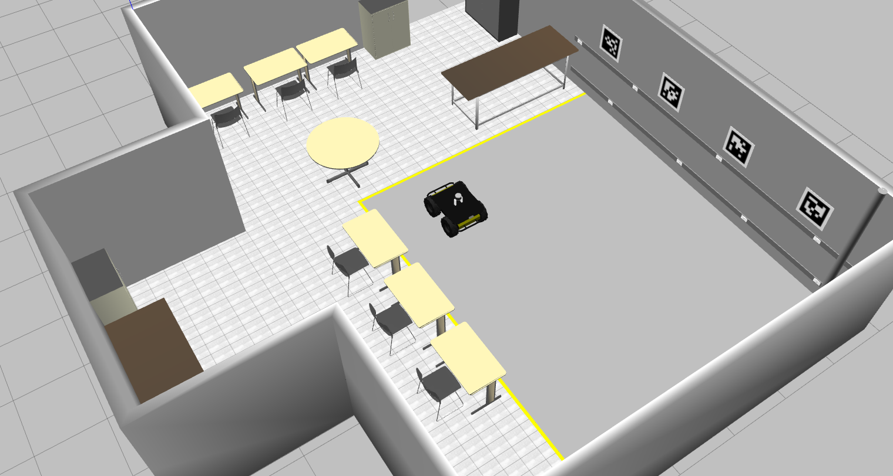
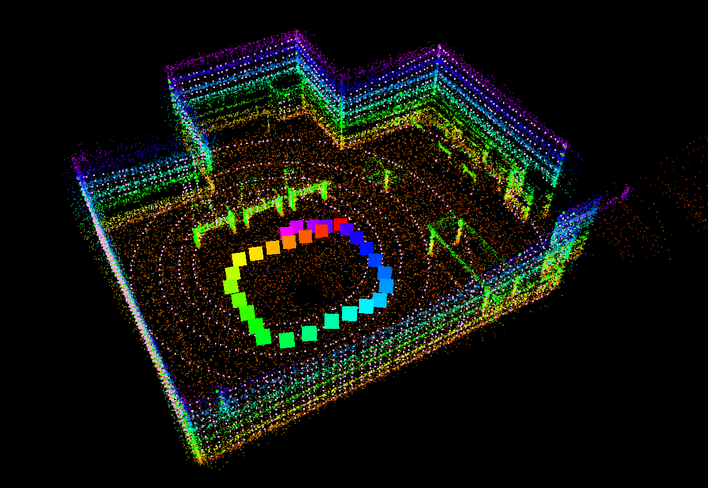
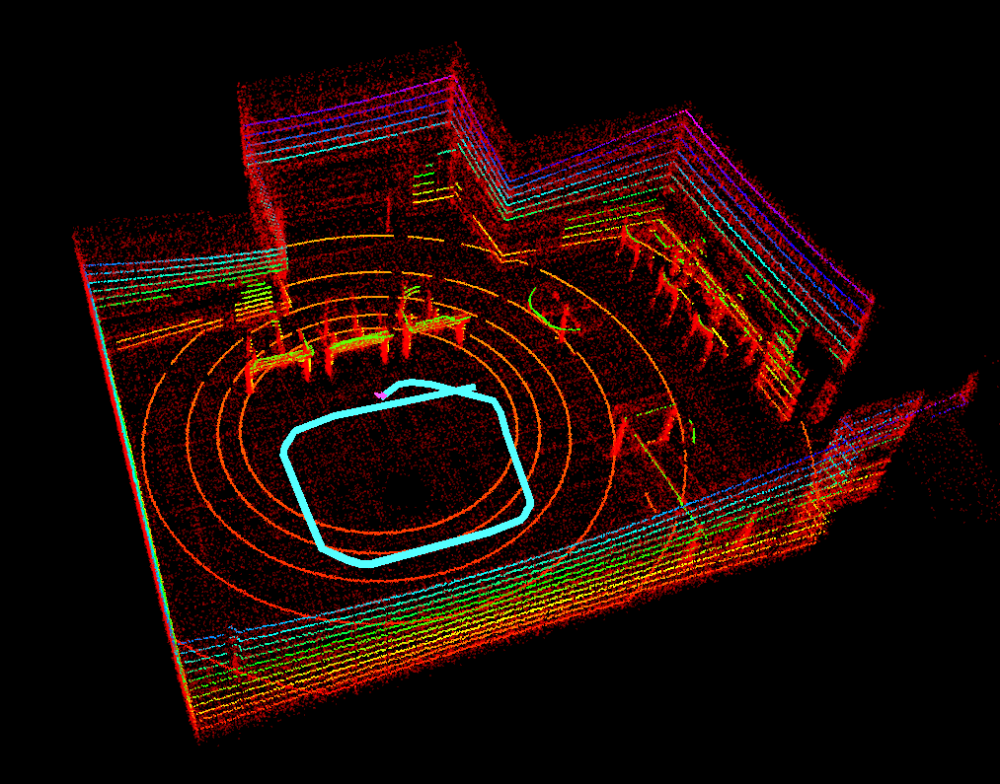
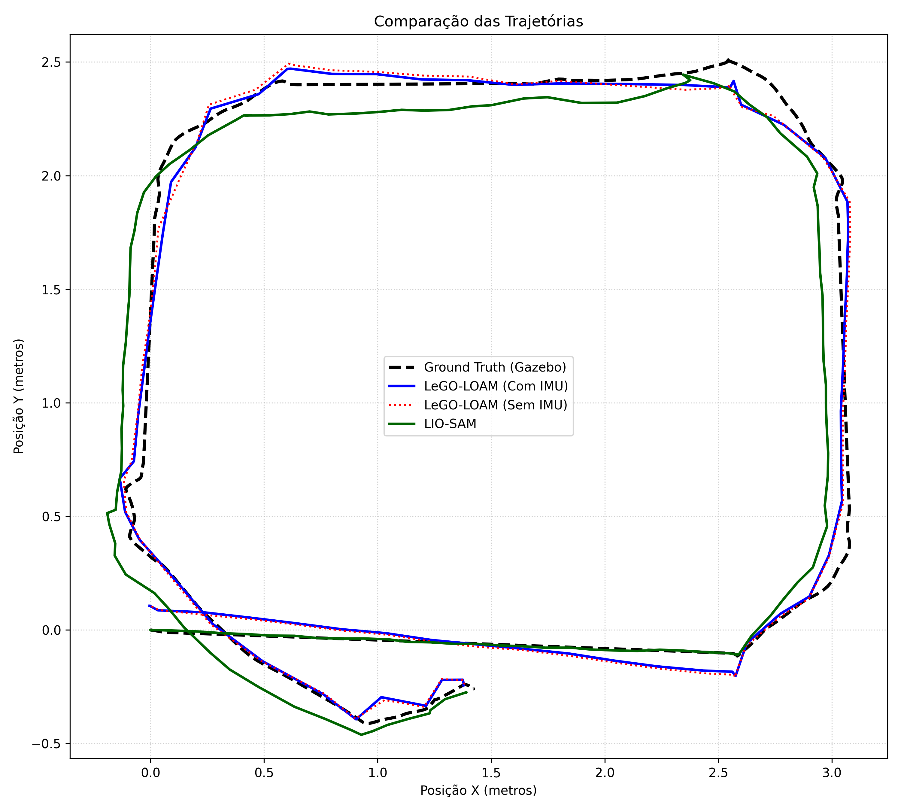
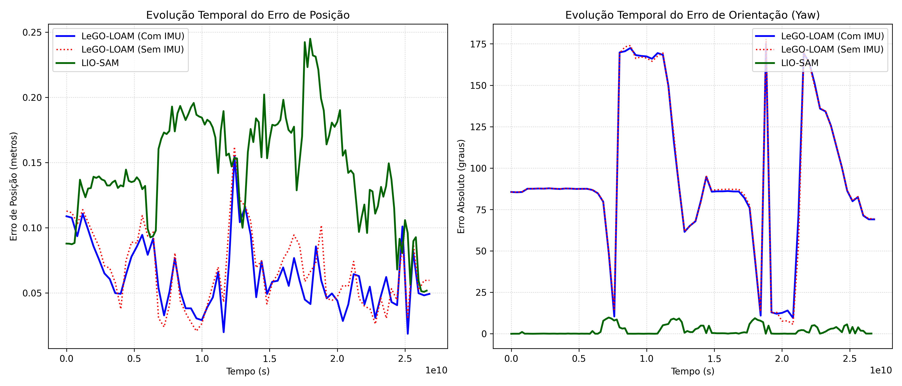

# Avaliação de Estratégias de SLAM LiDAR-IMU

Análise comparativa de estratégias SLAM LiDAR-IMU com LeGO-LOAM e LIO-SAM em ambiente simulado ROS/Gazebo, utilizando o UGV Clearpath Husky A200 e sensor Velodyne Puck VLP-16. Avalia acoplamento fraco (LeGO-LOAM) e fortemente acoplado (LIO-SAM) com dados de nuvem de pontos e IMU.

---

## Ambiente de Simulação

O ambiente simulado utilizado é o laboratório do LaR (Laboratório de Robótica) da UFBA, disponível no repositório [lar_gazebo](https://github.com/lar-deeufba/lar_gazebo). O robô utilizado é o Clearpath Husky A200 equipado com o sensor Velodyne Puck VLP-16.




---

## Mapas Gerados

### LeGO-LOAM

Vista isométrica do mapa gerado pelo LeGO-LOAM com coloração por altura:



### LIO-SAM

Vista isométrica do mapa gerado pelo LIO-SAM com trajetória estimada em azul claro:



---


## Resultados


### Comparação das Trajetórias

Comparação 2D das trajetórias estimadas pelos três modos contra o Ground Truth do Gazebo:



### Evolução Temporal dos Erros

Evolução temporal do erro de posição (metros) e erro de orientação em yaw (graus):



> **Nota sobre o erro de Yaw do LeGO-LOAM:** o erro absoluto de yaw (~94°) ocorre porque o LeGO-LOAM inicializa em um referencial local rotacionado em relação ao referencial global do Gazebo. O tracking relativo de posição é altamente preciso — o erro de yaw não reflete degradação do mapeamento, mas sim um desalinhamento de referencial entre o algoritmo e o ground truth.

### Precisão de Trajetória

| Algoritmo / Modo | Erro Médio Pos (m) | Erro Máximo Pos (m) | Erro Médio Yaw (°) |
|:---|:---:|:---:|:---:|
| LeGO-LOAM (Com IMU) | 0.0632 | 0.1549 | 94.8253 |
| LeGO-LOAM (Sem IMU) | 0.0680 | 0.1620 | 94.7035 |
| LIO-SAM | 0.1470 | 0.2449 | 2.0562 |

---

## Estrutura do Repositório

```
.
├── bags/                   # Bags ROS utilizados nos experimentos
├── images/                 # Imagens para o README
│   └── maps/               # Mapas gerados pelos algoritmos
├── analises/               # Scripts Python de análise e geração de gráficos
│   ├── plotar_trajetorias.py
│   └── erros_comparativo.py
├── lego_loam/              # Launch files e configuração do LeGO-LOAM
├── lio_sam/                # Launch files e configuração do LIO-SAM
└── README.md
```

---

## Dependências

- ROS Melodic (via Docker)
- [LeGO-LOAM](https://github.com/RobustFieldAutonomyLab/LeGO-LOAM)
- [LIO-SAM](https://github.com/TixiaoShan/LIO-SAM)
- Python 3 + pip
- [lar_gazebo (ROS Noetic)](https://github.com/lar-deeufba/lar_gazebo) — para geração de novas bags

---

## Como Usar

### 1. Configuração do Docker

Clone este repositório em um local fixo:

```bash
# Caminho sugerido
/home/seu_usuario/ros_workspace
```

Suba o container Docker com ROS Melodic:

```bash
docker run -it \
  -v /home/seu_usuario/ros_workspace:/root/catkin_ws \
  --name workspace_melodic \
  osrf/ros:melodic-desktop-full
```

Instale as dependências Python:

```bash
sudo apt update
sudo apt install python3-pip -y
```

---

### 2. Gravação de uma Nova Bag (opcional)

Para gravar uma nova bag no ambiente simulado do lar_gazebo:

**Terminal 1** — subir o ambiente Gazebo:
```bash
cd ~/lar_gazebo-noetic
./scripts/run_husky.sh
```

**Terminal 2** — iniciar a gravação:
```bash
cd ~/lar_gazebo-noetic
./scripts/shell.sh
cd /ws/src/lar_gazebo/bags/
rosbag record /gazebo_ground_truth/odom /imu/data /tf /tf_static /velodyne_points \
  -O caminho_husky.bag
```

**Terminal 3** — controlar o Husky com teleop:
```bash
cd ~/lar_gazebo-noetic
./scripts/shell.sh
rosrun teleop_twist_keyboard teleop_twist_keyboard.py
```

Controles do teleop:
- `u / i / o` — frente (esquerda / reto / direita)
- `j / k / l` — gira no eixo (esquerda / parar / direita)
- `m / , / .` — ré (esquerda / reto / direita)

A bag utilizada neste experimento está disponível para download no Google Drive:

📦 **[Download da bag — Google Drive](https://drive.google.com/drive/folders/1uE2QlnkfLwvhhe4cZrvPHQz-vqMgg5U5?usp=sharing)**

Ela tem duração de **1:52 min (112s)** e contém os tópicos:

| Tópico | Msgs | Tipo |
|:---|:---:|:---|
| `/gazebo_ground_truth/odom` | 2802 | nav_msgs/Odometry |
| `/imu/data` | 5604 | sensor_msgs/Imu |
| `/tf` | 11208 | tf2_msgs/TFMessage |
| `/tf_static` | 1 | tf2_msgs/TFMessage |
| `/velodyne_points` | 1120 | sensor_msgs/PointCloud2 |

---

### 3. Rodando os Algoritmos

Habilite o display antes de iniciar:

```bash
xhost +local:docker
```

**Terminal 1** — iniciar o algoritmo e o RViz:

```bash
docker start workspace_melodic
docker exec -it workspace_melodic bash

cd /root/catkin_ws
source devel/setup.bash
export LIBGL_ALWAYS_SOFTWARE=1

# Para o LeGO-LOAM:
roslaunch lego_loam run.launch

# Para o LIO-SAM:
roslaunch lio_sam run.launch
```

**Terminal 2** — dar play na bag:

```bash
docker exec -it workspace_melodic bash

cd /root/catkin_ws
source devel/setup.bash
cd /root/catkin_ws/src/bags
rosbag play caminho_husky.bag --clock
```

---

### 4. Coletando Resultados

Abra um terminal de gravação **antes** de dar play na bag.

#### LeGO-LOAM sem IMU

No arquivo `utility.h` do LeGO-LOAM, substituir o `imuTopic` por `/imu_false/data` para que o algoritmo ignore a IMU:

```bash
rosbag record -O comparacao_legoLOAM_semIMU.bag \
  /gazebo_ground_truth/odom /aft_mapped_to_init /tf /tf_static

rostopic echo -b comparacao_legoLOAM_semIMU.bag -p /aft_mapped_to_init \
  > lego_loam_sem_imu_68.csv

rostopic echo -b comparacao_legoLOAM_semIMU.bag -p /gazebo_ground_truth/odom \
  > ground_truth.csv
```

#### LeGO-LOAM com IMU

Restaurar o `imuTopic` para `/imu/data` no `utility.h`:

```bash
rosbag record -O comparacao_legoLOAM_comIMU.bag \
  /gazebo_ground_truth/odom /aft_mapped_to_init /tf /tf_static

rostopic echo -b comparacao_legoLOAM_comIMU.bag -p /aft_mapped_to_init \
  > lego_loam_com_imu_68.csv
```

#### LIO-SAM

```bash
rosbag record -O comparacao_LIOSAM.bag \
  /gazebo_ground_truth/odom /lio_sam/mapping/odometry /tf /tf_static

rostopic echo -b comparacao_LIOSAM.bag -p /lio_sam/mapping/odometry \
  > lio_sam.csv
```

---

### 5. Gerando as Análises

Com todos os CSVs gerados, rode os scripts de análise:

```bash
docker exec -it workspace_melodic bash
cd /root/catkin_ws/src/analises

# Gráfico de comparação de trajetórias (alinhamento por Kabsch/SVD)
python3 plotar_trajetorias.py

# Gráfico e tabela de erros comparativos
python3 erros_comparativo.py
```

---

## Autora

- Ludmila Nascimento dos Anjos

**Orientador:** Prof. Dr. Tiago Trindade Ribeiro  
**Coorientador:** Prof. Dr. Paulo Cesar Machado de Abreu Farias

Programa de Pós-Graduação em Engenharia Elétrica e de Computação — UFBA


